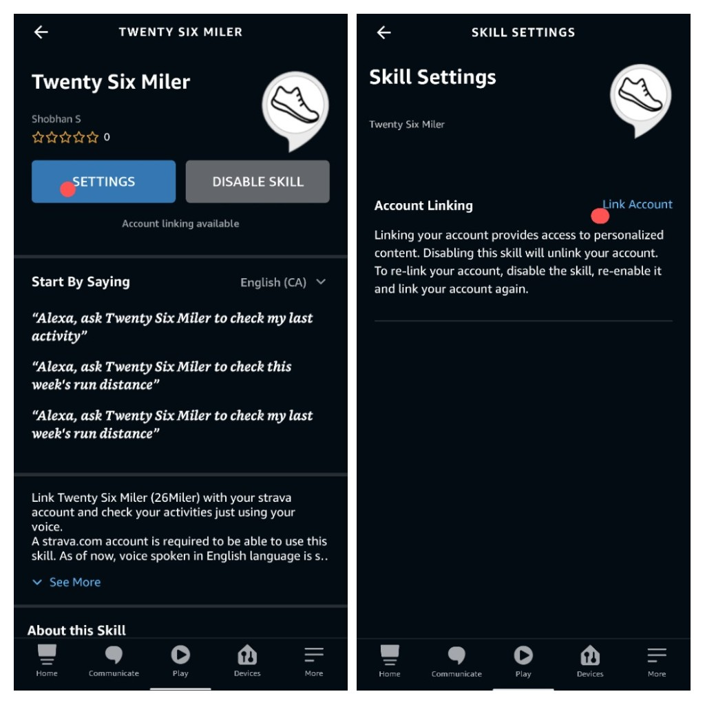

## Welcome to 26Miler

- 👋 I can get your strava activities just by using voice, e.g. 'Alexa ask 26miler to check my last activity'
- 🌱 I’m currently learning more skills to read different stats using strava api

### Steps to Activate 26Miler Skill
- Search skills and games on your Alexa App (must be pre-installed on your phone) with keywords, 26 miler or strava. From search results, pick 'Twenty Six Miler' and enable the skill
- Once enabled, you must complete the account linking. For that, tap 'settings button' --> tap 'link' --> sign in using your strava account credentials (refer to screenshot below)


### Voice command list
```markdown
- Alexa open 26miler
- help

- Alexa ask 26miler to check my last activity

- Alexa ask 26miler to check this week's run summary
- Alexa ask 26miler to check this week's walking summary
- Alexa ask 26miler to check this week's biking summary
- Alexa ask 26miler, how much I ran/walked/biked this week

- Alexa ask 26miler to check last week's run summary
- Alexa ask 26miler to check last week's walking summary
- Alexa ask 26miler to check last week's biking summary
- Alexa ask 26miler, how much I ran/walked/biked last week

# More commands would be added in future
```

### Country Availability Details
- Canada [Link to skill store](https://www.amazon.ca/dp/B09WDM5P4L)
- India [Link to skill store](https://www.amazon.in/dp/B09WDM5P4L)
- United States [Link to skill store](https://www.amazon.com/dp/B09WDM5P4L)
- United Kingdom [Link to skill store](https://www.amazon.co.uk/dp/B09WDM5P4L)
- Australia [Link to skill store](https://www.amazon.com.au/dp/B09WDM5P4L)

### Privacy Policy
[Privacy Policy](https://26miler.github.io/privacy-policy)

### Terms of use
[Terms of use](https://26miler.github.io/terms-of-use)
